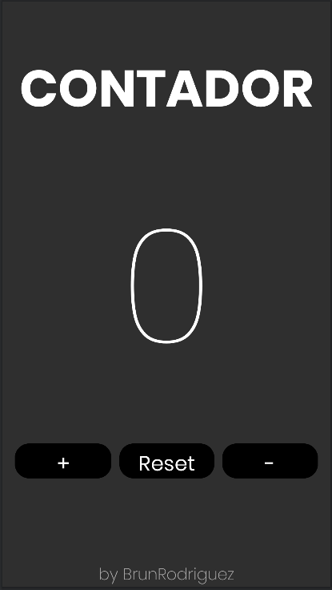
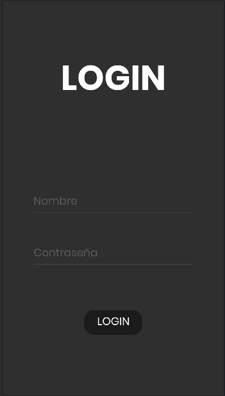
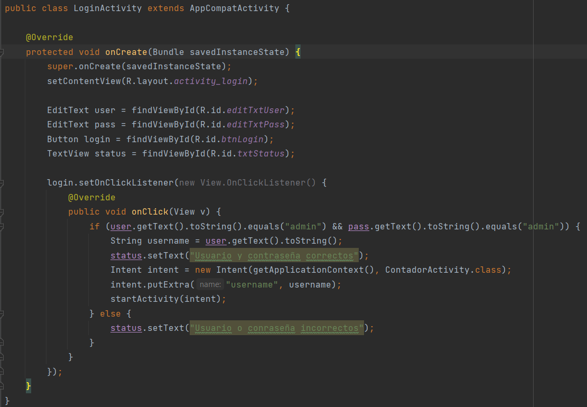
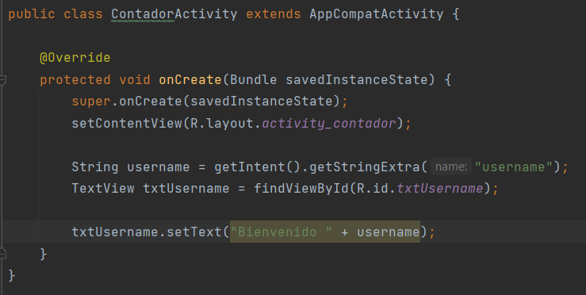
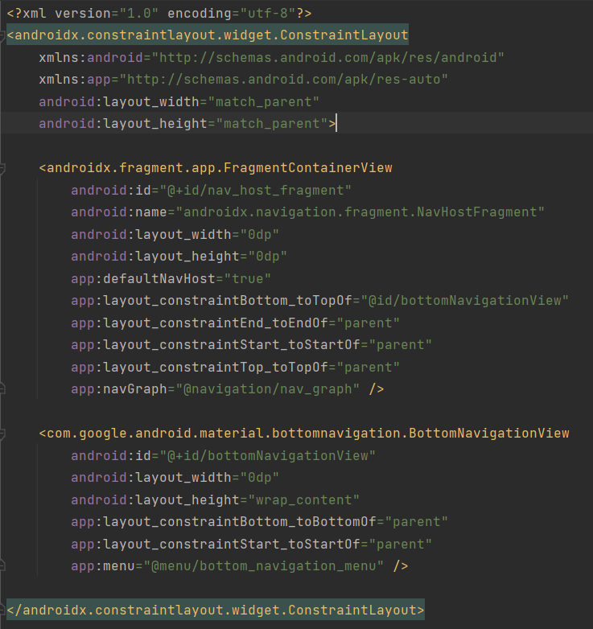
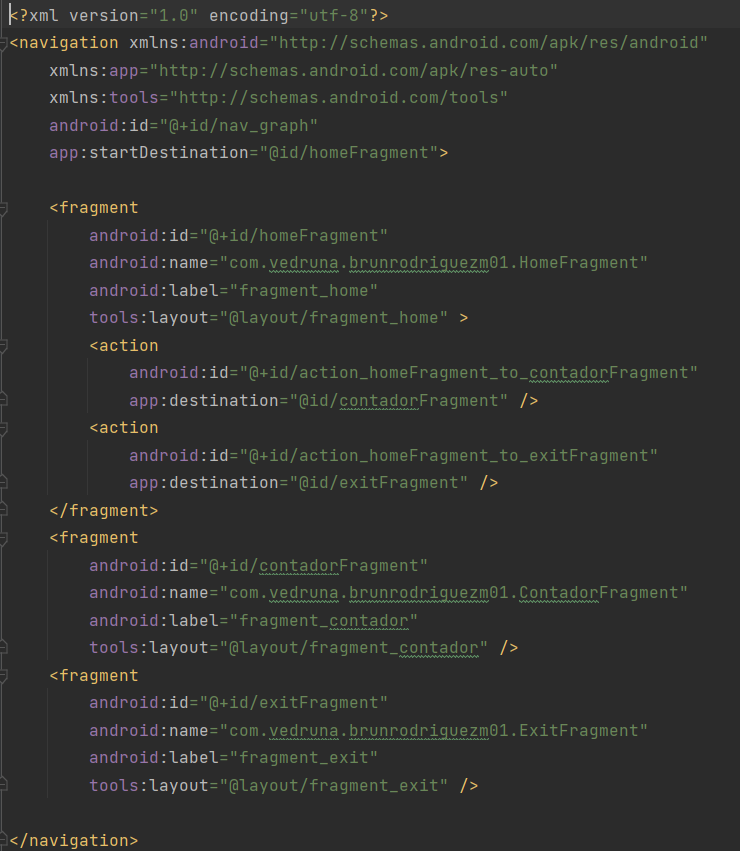
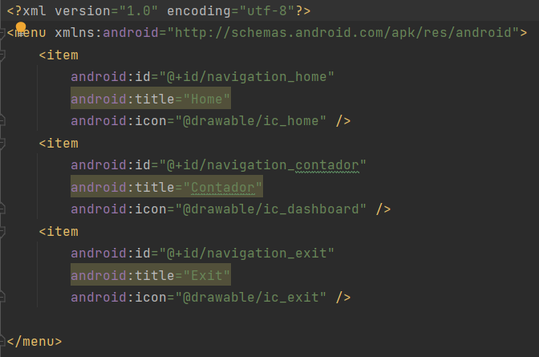
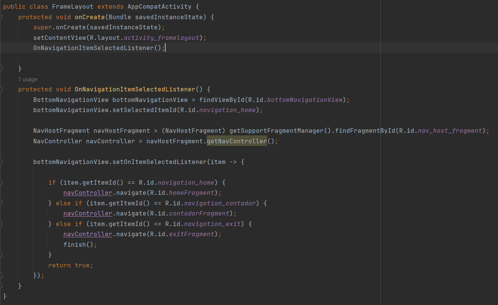
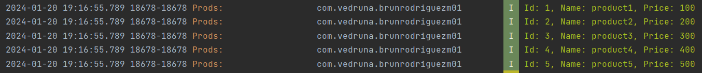

# BrunRodriguezM01

## EJERCICIO 01

Deberás recrear en android la aplicación del contador que se os proporciona. El diseño se os pasará
por figma (abajo teneis el enlace). En este primer ejercicio solo debes hacer la parte visual, nada
de lógica. Asegurate de que el resultado final sea identico al proporcionado, en tu criterio queda
elegir el o los tipos de layouts que utilizarás. Mediante figma obtén el tipo de fuente, colores etc
que debes utilizar en tu aplicación.

## Comentario

Se ha creado un nuevo layout llamado activity_contador, junto a su clase controlador correspondiente
ContadorActivity.
En la nueva activity se han creado los siguientes elementos:

* Un TextView txtContador con el texto Contador.
* Un TextView txtDisplay con el texto 0. Este TextView se usará como display de la cantidad del
  contador en futuras versiones.
* Un LinearLayout horizontal con 3 botones:
  -btnAdd que se usará para añadir una unidad al contador.
  -btnReset que se usará para regresar la cantidad del contador a 0.
  -btnSub que se usará para restar una unidad a la cantidad del contador.
* Un TextView txtName que muestra los apellidos del creador de la aplicación.

Se han modificado los atributos de estos elementos para intentar que sean lo más responsive posible
y para adaptarlos a las peticiones del figma.

A petición del ejercicio solo se han creado los elementos visuales de la pantalla, la lógica de las
operaciones se añadirá en versiones futuras.

## EJERCICIO 02

Crea la segunda pantalla en el mismo proyecto(investiga como). Deberás realizar un lógin tal y como
se muestra en el figma, en el caso de que el usuario y contraseña sean admin en el TextView de abajo
saldrá “Usuario y contraseña correcta” en caso contrario “Usuario o contraseña incorrecta”.
Investigar por vuestra cuenta como iniciar la aplicación en la Activity login. Pista → se configura
en el AndroidManifest.xml. Una vez que iniciemos el login deberá pasar a la pantalla del contador
pasando el dato del nombre del usuario (aparecerá en la parte baja de la pantalla de contador donde
ponía “by nombre_alumno”).(ACTUALIZADO)

## Comentario

Se ha creado un nuevo layout llamado activity_login, junto a una nueva clase LoginActivity.
En la nueva activity se han añadido los siguientes elementos:

* Un TextView txtLogin con el texto Login.
* Un EditText editTextUser para el input del nombre de usuario.
* Un EditText editTextPass para el imput de la contraseña.
* Un boton btnLOGIN para iniciar el metodo de inicio de sesión.
* Un TextView txtStatus que muestra al usuario si el inicio de sesión fue correcto o no.

Se han modificado los atributos de estos elementos intentando que sean lo más responsive posible y
para adaptarlos a las peticiones del figma.

Además se ha creado un método de inicio de sesión en el controlador ActivityLogin. Este método
comprueba si la cadena introducida en los campos de usuario y contraseña es admin. De ser así, el
texto del TextView txtStatus cambiará a su mensje correspondiente "Usuario y contraseña correctos" y
se procederá a cambiar a la activity_contador. Además se recogerá la cadena introducida en el campo
de nombre de usuario para mostrarlo por pantalla en la activity_Contador en el TextView txtUsername.
Si el nombre de usuario o contraseña son incorrectos (a petición del ejercicio, si no son "admin"),
el texto de txtStatus pasará a mostrar el mensaje "Usuario o contraseña incorrectos" y no se
producirá el cambio de pantalla.

## Otros cambios

* El TextView txtName de la activity_contador se ha cambiado a txtUsername y ahora mostrará el
  nombre del usuario cuando se haya iniciado sesión.
* Se ha cambiado el código a ContadorActivity para que recoja la String del nombre de usuario del
  campo txtEditUser de la activity_Login para que al iniciar sesión se muestre a traves del texto de
  txtUsername.

## EJERCICIO 03

Cambia el proyecto para que el segundo activity en vez de ser el contador sea un activity con un
FrameLayout en el que se verán los diferentes fragments (mínimo home, contador, salir) y por otra
parte una barra de navegación con la que podamos viajar entre los diferentes fragments.

## Comentario

* Se ha creado un nuevo layout llamado activity_framelayout. Este activity es la base del contenido
  de este ejercicio.
  Contiene un FragmentContainerView con id nav_host_fragment y un BottomNavigationView con id
  bottomNavigationView.

* Se ha creado una carpeta navigation junto a un navigation resource file llamado nav_graph. En este
  hemos creado 3 fragmentos:

- fragment_home con id homeFragment. Contiene un texto con la palabra "Home" y sera el fragmento.
  principal de FrameLayout.
- fragment_contador con id contadorFragment. Este fragmento contiene el codigo que contenia
  anteriormente al activity_contador.
- fragment_exit con id exitFragment. Contiene un texto con la palabra "Salir".

  También se han creado las referencias de navegación entre los distintos fragments

  A continuación se han creado 3 clases vinculadas a cada uno de los fragments: ContadorFragment,
  HomeFragment y ExitFragment. Estas clases serán las encargadas de crear las vistas su fragmento
  respectivo.

* Añadimos una referencia en nav_host_fragment de esta manera: app:navGraph="@navigation/nav_graph"

* Se ha creado una carpeta menu junto a un menu resource file llamado bottom_navigation_menu.

* Añadimos una referencia en bottomNavigationView de esta manera:  app:menu="
  @menu/bottom_navigation_menu"

* Se ha creado la clase FrameLayout vinculada a activity_framelayout. Esta clase se encarga de crear
  la vista de activity_framelayout.
  Además maneja la lógica detras de la navegación del bottomNavigatioView de esta manera:

- BottomNavigationView bottomNavigationView = findViewById(R.id.bottomNavigationView);
  bottomNavigationView.setSelectedItemId(R.id.navigation_home);
  Encontramos el bottomNavigationView y selccionamos FragmentHome como default.

- NavHostFragment navHostFragment = (NavHostFragment) getSupportFragmentManager().findFragmentById(
  R.id.nav_host_fragment);
  NavController navController = navHostFragment.getNavController();
  Indicamos que navHostFragment en activityFrameLayout sera donde mostraremos nuestros fragments y
  le asignaremos el controlador de navegación que vinculamos anteriormente.

- bottomNavigationView.setOnItemSelectedListener(item -> {
  if (item.getItemId() == R.id.navigation_home) {
  navController.navigate(R.id.homeFragment);
  } else if (item.getItemId() == R.id.navigation_contador) {
  navController.navigate(R.id.contadorFragment);
  } else if (item.getItemId() == R.id.navigation_exit) {
  navController.navigate(R.id.exitFragment);
  finish();
  }
  return true;
  });
  Por último asignaremos cada uno de los controles del bottomNavigationView a los fragmentos
  creados.

* Tras esto vincularemos nuestro LoginActivity al nuevo FrameLayout en vez de al ContadorActivity.
  De esta manera cuando el usuario
  inicie sesión con éxito se trasladara a la vista del FrameLayout y podrá navegar entre los nuevos
  fragmentos creados.

 

## EJERCICIO 04

Añade un Fragment mas que se llame API y sigue el tutorial (para la parte del consumo de la API)
proporcionado para consumir un API con android(en esta entrega no tendrás que reflejar los resultado
en la interfaz gráfica, solo en el log). Por otro lado crea un microservicio con una sola entidad.

## Comentario

* Se ha creado un nuevo fragment ApiFragment junto a su archivo xml correspondiente
  fragment_api.xml.

* Se ha creado un nuevo paquete modelo y una nueva clase Product.

* Se ha creado una nueva carpeta interfaces y una nueva interfáz CRUDInterface.

* Se ha añadido codigo a la activity principal LoginActivity que permite consumir la api
  retrofit-apirest.

- El metodo nos permite hacer una solicitud GET utilizando Retrofit y maneja la respuesta exitosa
  mostrando todos los productos a través del log y maneja errores que pueden ocurrir durante la
  solicitud.

.png)

* En entregas posteriores se mostrará la lista de productos a través del nuevo fragment creado en
  vez de por consola.
